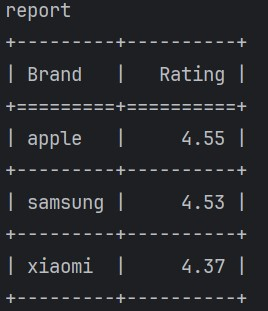
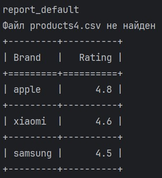

## Запуск скрипта производится командой
```bash
  python main.py --files products1.csv products2.csv 
```
### Если указан обязательный флаг --files и название существующих файлов, то выйдет отчет в формате  
```bash
    python main.py --files products1.csv products2.csv --report report
```
  
### Если не указать название файла, то выйдет ошибка:

```commandline
main.py: error: Флаг --files указан, но не указаны имена файлов! Пример: --files file1.csv file2.csv

```
### Если не указать обязательный флаг --files, то выйдет ошибка:

```commandline
main.py: error: Не указан обязательный флаг --files! Пример: --files file1.csv file2.csv
```
### Если указать флаг --report, но не указано имя отчета, выйдет ошибка:

```commandline
main.py: error: Флаг --report указан, но не указано имя отчета! Пример report
```
### Если один из файлов отсутствует, то отчет будет сформирован по имеющимся файлам, в консоли будет информация, о файлах, которые не были найдены
```bash
  python main.py --files products1.csv products4.csv
```


### Если файл/файлы пустые, выйдет сообщение:
```commandline
report_default
Файлы не найдены или пустые
```

### Дополнительно! Для добавления нового отчета, по цене, необходимо добавить флаг, например type, немного переделать логику функции get_avg_rating. Она будет принимать дополнительный аргумент и в зависимости от него собирать соответствующий словарь с сырыми данными, для дальнейшей агрегации 